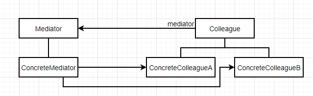

# 中介者（Mediator）

### 意图

用一个中介对象来封装一系列的对象交互。中介者使各对象不需要显式地相互引用，从而使其耦合松散，而且可以独立地改变它们之间的交互

### 适用性

- 一组对象以定义良好但复杂的方式进行通信，产生的相互依赖关系结构混乱且难以理解
- 一个对象引用其他很多对象并且直接与这些对象通信，导致难以复用该对象
- 想定制一个分布在多个类中的行为，而又不想生成太多的子类

### 结构



### 参与者

- Mediator：定义一个接口用于与各同事对象通信
- ConcreteMediator：
  - 协调各同事对象实现协作行为
  - 了解并维护它的各个同事
- Colleague：
  - 每一个同事类都知道它的中介者对象
  - 每一个同事对象在需要与其他同事通信的时候，与它的中介者通信

### 协作

同事向一个中介者对象发送和接收请求。中介者在各同事间适当地转发请求以实现协作行为

### 效果

优点：

- 减少了子类生成：将原本分布在各个对象间的行为集中在一起，只需要改变Mediator子类就可以改变这些行为
- 将各Colleague解耦：有利于各Colleague之间的松耦合
- 简化了对象协议：用Mediator和Colleague之间的一对一交互代替了多对多交互
- 对对象如何协作进行了抽象：将中介作为一个独立的概念并将其封装在一个对象中，可以将注意力集中于对象之间的交互上

缺点：

- 使控制集中化：中介者对象可能变得十分复杂且难以维护

### 实例

一个机器人由处理中心和肢体组成：

```c++
class Center {
public:
    virtual ~Center();
    virtual void Control(Limb*);
protected:
    Center();
};
```

```c++
class Limb {
public:
    Limb(Head*);
    virtual void Action();
private:
    Head* _head;
};
```

其中肢体分为手和脚：

```c++
class Hand : public Limb {
public:
    Hand(Head* h) : _head(h) {}
    virtual void Action()
    	{ _head->Control(this); }
    
    // 其他手操作...
    
private:
    Head* _head;
};
```

```c++
class Foot : public Limb {
public:
    Foot(Head* h) : _head(h) {}
    virtual void Action()
    	{ _head->Control(this); }
    
    // 其他脚操作...
    
private:
    Head* _head;
};
```

这样肢体就只与头交流，而肢体处理中心负责统筹所有肢体的协作：

```c++
class LimbCenter : public Center {
public:
    NormalCenter();
    virtual void Control(Limb*);
    virtual void SetLimbs(Limb*, Limb*, Limb*, Limb*);
private:
    Hand* leftHand;
    Hand* rightHand;
    Foot* leftFoot;
    Foot* rightFoot;
};
```

```c++
void NormalCenter::Control(Limb* l) {
    if (l == leftHand) {
        // 左手操作...
    } else if (l == rightHand) {
        // 右手操作...
    } else if (l == leftFoot) {
        // 左脚操作...
    } else {
        // 右脚操作...
    }
}
```

现在，每个肢体仅和肢体处理中心交互，但它们可以互相协作：

```c++
Hand* lh = new Hand;
Hand* rh = new Hand;
Foot* lf = new Foot;
Foot* rf = new Foot;
LimbCenter* center = new LimbCenter;
center.SetLimbs(lh, rh, lf, rf);
```

### 技巧

1. **忽略抽象的Mediator类**：当各Colleague仅与一个Mediator一起工作时，没有必要定义一个抽象的Mediator类
2. **Colleague-Mediator通信**：可以用**Observer模式**，将Mediator实现为一个Observer，各Colleague作为Subject；或再Mediator中定义一个特殊的通知接口，Colleague直接调用该接口