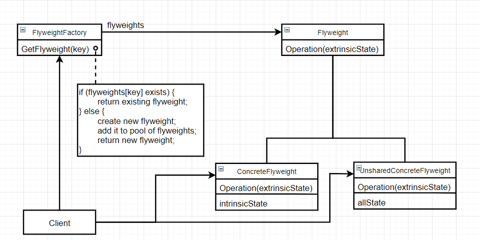
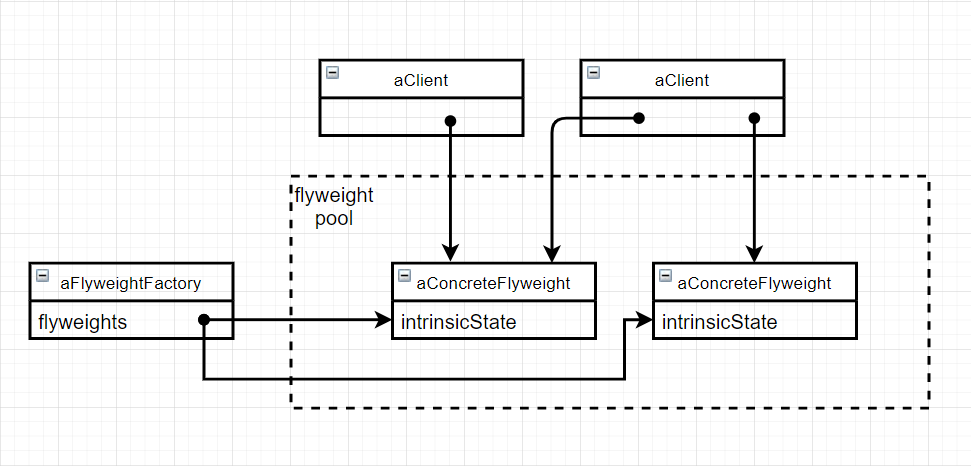

# 享元（Flyweight）

### 意图

运用共享技术有效地支持大量细粒度的对象

### 适用性

下列情况**都成立**时使用：

- 一个应用程序使用了大量对象
- 完全由于使用大量对象造成了很大的内存开销
- 对象的大多数状态都可变为外部状态
- 如果删除对象的外部状态，那么可以用相对较少的共享对象取代很多组对象
- 应用程序不依赖于对象标识。因为Flyweight对象可以被共享，因此对于概念上明显有别的对象，标识测试将返回真值

### 结构



下面的对象图说明如何共享flyweight：



### 参与者

- Flyweight：描述一个接口，通过这个接口flyweight可以接受并作用于外部状态
- ConcreteFlyweight：实现Flyweight接口，并为内部状态增加存储空间。必须是可共享的，存储的状态必须是内部的（独立于ConcreteFlyweight对象的场景）
- UnsharedConcreteFlyweight：并非所有Flyweight子类都需要被共享
- FlyweightFactory：
  - 创建并管理flyweight对象
  - 确保合理地共享flyweight对象
- Client：
  - 维持一个对flyweight的引用
  - 计算或存储一个（多个）flyweight的外部状态

### 协作

- flyweight执行时所需的状态必定是内部的或外部的。内部状态存储于ConcreteFlyweight对象中，外部状态由Client对象存储或计算；用户调用flyweight对象的操作时，将状态传递给它
- 用户不直接对ConcreteFlyweight类进行实例化，只能从FlyweightFactory对象得到ConcreteFlyweight对象。从而保证对它们适当地共享

### 效果

优点：

- 存储节约

缺点：

- 传输、查找/计算外部状态都会产生运行时开销

### 实例

在一款“扫雷puls pro max ultra”游戏中，地雷有炫酷的外观和华丽的粒子特效，但绝大多数地雷的纹理和粒子效果相同，如果每个地雷都对应一个地雷类的实例，会占用巨大的内存空间。使用Flyweight可以解决该问题：

```c++
class Landmine {
public:
    virtual ~Landmine();
    
    virtual void Boom(Point&);	// 在给定的位置爆炸，Point是外部状态
private:
    Texture text;
    Particle part;
};
```

为了保证Landmine被合适地共享，需要由一个LandmineFactory创建并访问Landmine实例：

```c++
class LandmineFactory {
public:
    LandmineFactory();
    
    Landmine* GetLandmine(Texture& text, Particle& part);
private:
    List<Landmine*> landmines;
};
```

```c++
Landmine* LandmineFactory::GetLandmine(Texture& text, Particle& part) {
    Landmine* landminePtr = landmines.Find(text, part);
    if landminePtr == nullptr {
        landminePtr = new Landmine(text, part);
        landmines.Insert(landminePtr);
    }
    return landminePtr;
}
```

这样具有相同纹理和粒子效果的地雷就会被共享，从而节省了空间，而客户需要管理对象的外部状态：

```c++
LandmineFactory factory;
Texture* landmineText = new Texture("landmine");
Particle* landminePart = new Particle("landmine");

// ...

Point* p = ComputePoint();

Landmine* m = factory.GetLandmine(landmineText, landminePart);
m.Boom(p);
```

### 技巧

1. **删除外部状态**：理想的状况是，外部状态可以由一个单独的对象结构计算得到，且该结构的存储要求非常小
2. **管理共享对象**：因为对象是共享的，用户不能直接对它进行实例化，所以需要一个Factory。同时，共享对象还意味着垃圾回收