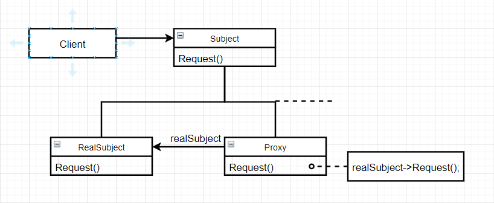

# 代理（Proxy）

### 意图

为其他对象提供一种代理以控制对这个对象的访问

### 别名

Surrogate

### 适用性

需要用比较通用和复杂的对象指针代替简单指针的时候

1. 远程代理（Remote Proxy）：为一个对象在不同的地址空间提供局部代表
2. 虚代理（Virtual Proxy）：根据需要创建开销很大的对象
3. 保护代理（Protection Proxy）：控制原始对象的访问，用于对象应该由不同的访问权限
4. 智能指引（Smart Reference）：取代简单指针，在访问对象时执行一些附加操作
   - 对指向实际对象的引用计数，当对象没有引用时可以自动释放它
   - 当第一次引用一个持久对象时，将他装入内存
   - 在访问一个实际对象前，检查是否已经锁定了它，以确保其他对象不能改变它

### 结构



### 参与者

- Proxy：

  - 保存一个引用使得代理可以访问实体
  - 提供一个与Subject的接口相同的接口
  - 控制对实体的存取，并可能负责创建和删除它

  同时根据代理类型不同：

  - Remote Proxy负责对请求及其参数进行编码，并向不同地址空间中的实体发送已编码的请求
  - Virtual Proxy可以缓存实体的附加信息，以便延迟对它的访问
  - Protection Proxy检查调用者是否具有实现一个请求所必需的访问权限

- Subject：定义RealSubject和Proxy的共用接口，这样就在任何使用RealSubject的地方都可以使用Proxy

- RealSubject：定义Proxy所代表的实体

### 协作

代理根据其种类，在适当的时候向RealSubject转发请求

### 效果

1. Remote Proxy可以隐藏一个对象存在于不同地址空间的事实
2. Virtual Proxy可以进行最优化，例如根据需要创建对象
3. Protection Proxies和Smart Reference都允许在访问一个对象时有一些附加的内务处理

### 实例

在上网时，经常需要一个代理服务器转发我们的请求，让我们可以访问一些不存在的网站：

```c++
class WebProxy {
public:
    WebProxy();
    
    virtual Response* GetResponse(Request* req);
    virtual Request* GetRequest();
    virtual void SendResponse(Response* resp);
    
    //...
    
private:
    Client* _client;
    Server* _server;
};
```

代理服务器简单地转发我们的请求给目标服务器，然后再转发目标服务器的响应给我们。在我们看来仅仅访问了代理服务器，然而实际上是在访问了各种不同的网站：

```c++
Response* WebProxy::GetResponse(Request* req) {
    _client->SendRequest(req);
    return _client->GetResponse();
}

Request* WebProxy::GetRequest() {
    return _server->GetRequest();
}

void WebProxy::SendResponse(Response* resp) {
    _server->SendResponse(resp);
}
```

```c++
WebProxy* proxy = new WebProxy;

// connect to client...

Request* req = proxy->GetRequest();
Response* resp = proxy->GetResponse();
proxy->SendResponse();
```

### 技巧

1. **Proxy并不总是需要知道实体的类型**：若Proxy类能够完全通过一个抽象接口处理它的实体，则无需为每一个RealSubject类都生成一个Proxy类，Proxy可以统一处理所有的RealSubject类
