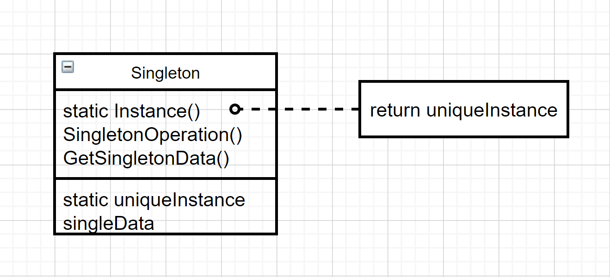

# 单件（Singleton）

### 意图

保证一个类仅有一个实例，并提供一个访问它的全局访问点

### 适用性

- 当类只能有一个实例而且客户可以从一个众所周知的访问点访问它时
- 当这个唯一的实例应该是通过子类化可扩展的，并且客户应该无须更改代码就能使用一个扩展的实例时

### 结构



### 参与者

- Singleton：定义一个Instance操作，允许客户访问它的唯一实例。**Instance是一个类操作**
- 可能负责创建它自己的唯一实例

### 效果

- 对唯一实例的受控访问：严格控制客户怎样以及如何访问实例
- 缩小命名空间：Singleton模式是对全局变量的一种改进，避免了污染命名空间
- 允许对操作和表示的精化：可以有子类，用扩展子类的实例配置一个应用是很容易的
- 允许可变数目的实例：可以控制实例的数目（不只是一个，而是多个）
- 比类操作更灵活

### 实例

在使用抽象工厂模式时，通常希望每种工厂只有一个实例，这样就用到了单件模式：

```c++
class Factory {
public:
    static Factory* Instance();
protected:
    // 构造函数是保护型的，确保仅有一个实例被创建
    Factory();
private:
    static Factory* _instance;
};
```

```c++
Factory* Factory::_instance = nullptr;

Factory* Factory::Instance() {
    if _instance == nullptr {
        _instance = new Factory;
    }
    return _instance;
}
```

如果Factory存在子类，必须决定使用哪个子类时，`Instance()`的实现需要修改：

```c++
Factory* Factory::Instance() {
    if _instance == nullptr {
        const char* style = getenv("STYLE");
        
        if (strcmp(style, "A") == 0) {
            _instance = new FactoryA;
        } else if (strcmp(style, "B") == 0) {
            _instance = new FactoryB;
            
        // 其他可能情况
            
        } else {
            // 默认情况
            _instance = new Factory;
        }
    }
    return _instance;
}
```

上述方法在定义新的Factory子类时，都必须修改`Instance()`，一个解决办法是使用注册表办法

### 技巧

- 保证一个唯一的实例：将创建实例的操作隐藏在类操作后面，由它保证只有一个实例被创建

- 创建Singleton类的子类：使用一个**单件注册表**，`Instance()`函数在注册表中查找单件并返回：

  ```c++
  class Singleton {
  public:
      static Singleton* Instance();
      static void Register(const char* name, Singleton*);
  protected:
      static Singleton* Lookup(const char* name);
  private:
      static Singleton* _instance;
      static List<NameSingletonPair>* _register;
  };
  ```

  Register以给定的名字注册Singleton实例，`Instance()`调用`Lookup()`函数根据给定单件的名称进行查找：

  ```c++
  Singleton* Singleton::Instance() {
      if _instance == nullptr {
          const char* name = getenv("SINGLETON");
          _instance = Lookup(name);
      }
      return _instance;
  }
  ```

  Singleton在何处注册自己？一种方法是在构造函数中：

  ```c++
  Singleton::Singleton() {
      //...
      Singleton::Register("SingletonA", this);
  }
  ```

  用这种方法Singleton类不再负责创建单件，而是确保选择的单件对象可以在系统中被访问。创建由定义一个静态实例完成：

  ```c++
  static SingletonA theSingletonA
  ```

  `Register()`函数仅在Singleton构造时被调用一次，缺点是所有可能的Singleton都必须被创建才能注册