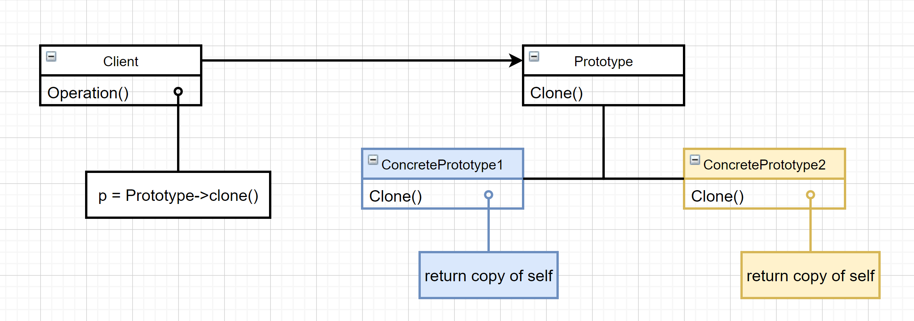

# 原型（Prototype）

### 意图

用原型实例指定创建对象的种类，并通过拷贝这些原型创建新的对象

### 适用性

- 当一个系统应该独立于它的产品创建、构成和表示时
- 当要实例化的类是在运行时指定时
- 为了避免创建一个与产品类层次平行的工厂层次时
- 当一个类的实例只能有几个不同状态组合中的一种时。建立相应数目的原型并克隆他们可能比每次用合适的状态手动实例化类更方便

### 结构



### 参与者

- Prototype：声明一个克隆自身的接口
- ConcretePrototype：实现一个克隆自身的操作
- Client：让一个原型克隆自身从而创建一个新的对象

### 协作

客户请求一个原型克隆自身

### 效果

优点：

- 运行时增加和删除产品：客户仅需要注册一个原型实例就能将一个新的具体产品类并入系统，比其他创建型模式更为灵活
- 改变值以指定新对象：通过实例化已有的类并且将这些实例注册成为客户对象的原型，就可以有效定义新类别的对象
- 改变结构以指定新对象：许多应用由部件和子部件来创建对象，可以将部件定义为原型
- 减少子类的构造：克隆一个原型的方法不需要额外的Creator类层次

缺点：

- 所有Prototype子类都要实现Clone操作，当内部有不支持拷贝或者有循环引用的对象时，实现Clone会很困难

### 实例

原型模式可以轻松生成完全相同的几何对象副本，而无需代码和对象所属类耦合：

```C++
class Graph {
public:
    virtual Graph* Clone() const = 0;
protected:
    Graph();
    
    // 中点坐标
    int X;
    int Y;
};
```

用户可以根据自己的需要自定义任何图形，然后实现`Clone()`方法，以后就可以随时使用：

```c++
// 具体原型：矩形
class Rect : public Graph {
public:
    Rect(int x, int y, int w, int h):
    	width(w), height(h) { Graph(x, y); }
    
    virtual Graph* Clone() const
    	{ return new Rect(*this); }
private:
    int width;
    int height;
};

// 具体原型：圆形
class Circle : public Graph {
public:
    Circle(int x, int y, int r):
    	radius(r) { Graph(x, y); }
    
    virtual Graph* Clone() const
    	{ return new Circle(*this); }
private:
    int radius;
};
```

上面的代码定义了两个具体的图形并实现了`Clone()`方法，接下来使用它们：

```c++
Circle* StandardCircle = new Circle(0, 0, 1);	// 标准圆形 
Rect* StandardRect = new Rect(0, 0, 1, 1); // 标准矩形

// 在需要时，很容易得到标准图形的克隆
Circle* c1 = StandardCircle->Clone();
Rect* r1 = StandardRect->Clone();
```

### 技巧

1. 使用一个原型管理器（注册表）：在一个系统中的原型数目不固定时，维护一个可用原型的注册表。客户在注册表中存储和检索原型，我们称这个注册表是一个原型管理器。它是一个**关联存储器**，它返回一个与给定关键词相匹配的原型
2. 实现克隆操作：实现克隆操作是原型模式最难的部分，克隆一个原型通常需要**深拷贝**，克隆对象和原对象必须相互独立
3. 初始化克隆对象：有时需要**改变克隆对象的内部状态**，这时需要引入**Initialize**操作用初始化参数改变克隆对象的内部状态

