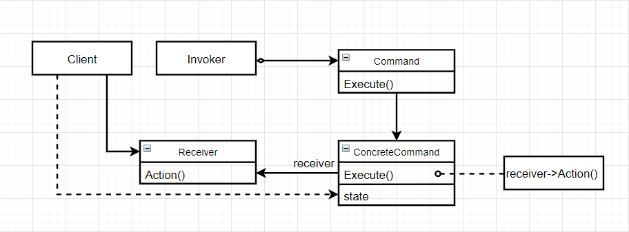
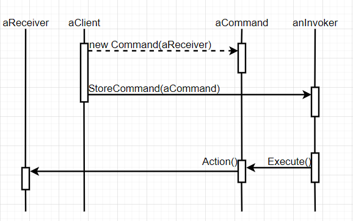

# 命令（Command）

### 意图

将一个请求封装为一个对象，从而使你可以使用不同的请求对客户进行参数化，对请求排队或记录请求日志，以及支持可撤销的操作

### 别名

动作（action），事务（transaction）

### 适用性

- **Command模式是回调机制的一个面向对象的替代品**
- 在不同的时刻指定、排列和执行请求
- 支持取消操作：Command在执行Execute操作之前将状态存储起来，在取消操作时用这个状态消除该操作的影响
- 支持修改日志，这样当系统崩溃时这些修改可以被重做一遍。在Command接口中添加装载操作和存储操作
- 用构建在原语操作上的高层操作构造一个系统

### 结构



### 参与者

- Command：声明执行操作的接口
- ConcreteCommand：
  - 将一个接收者对象绑定于一个动作
  - 调用接收者相应的操作，以实现Execute
- Client：创建一个具体命令对象并设定它的接收者
- Invoker：要求该命令执行这个请求
- Receiver：知道如何实施与执行一个请求相关的操作。**任何类都可能作为一个接收者**

### 协作



- Client创建一个ConcreteCommand对象并指定它的Receiver对象
- Invoker对象存储该ConcreteCommand对象
- Invoker对象通过调用ConcreteCommand对象的Execute操作来执行该请求
- ConcreteCommad对象调用它的Receiver对象的一些操作执行该请求

### 效果

1. 将调用操作的对象和知道如何实现该操作的对象解耦
2. Command对象可以像其他对象一样被操纵和扩展
3. 可以将多个命令装配成一个组合命令
4. 增加新的Command很容易，因为无需改变已有的类

### 实例

家庭中通常拥有各种电器，比如空调：

```c++
class Television {
public:
    Television();
    
    void ChangeChannel() { printf("改变电视频道\n"); }
    
    // 其它电视操作...
     
};
```

```c++
class AirConditioner {
public:
    AirConditioner();
    
    void Up() { printf("温度上调1°\n"); }
    void Down() { printf("温度下调1°\n"); }
    
    // 其他空调操作...
    
};
```

而手机可以来遥控它们，用Command模式可以很好地处理该问题：

```c++
class Command {
public:
    virtual ~Command();
    
    virtual void Execute();
protected:
    Command();
};
```

```c++
class ChangeCommand : public Command {
public:
    ChangeCommand(Television* tv) : _television(tv) {}
    
    virtual void Execute() { _television->ChangeChannel(); }
private:
    Television* _television;
};
```

```c++
class UpCommand : public Command {
public:
    UpCommand(AirConditioner* ac) : _airconditioner(ac) {}
    
    virtual void Execute() { _airconditioner->Up(); }
private:
    AirConditioner* _airconditioner;
};
```

```c++
class DownCommand : public Command {
public:
    UpCommand(AirConditioner* ac) : _airconditioner(ac) {}
    
    virtual void Execute() { _airconditioner->Down(); }
private:
    AirConditioner* _airconditioner;
};
```

```c++
class Phone {
public:
    Phone() { _cmds = new List<Command*>; }
    
    void Remote(Command* cmd);
    void Memory();
    
    virtual Iterator<Command*>* CreateIter();
private:
    List<Command*>* _cmds;
};

void Phone::Remote(Command* cmd) {
    cmd->Execute();
    _cmds->Add(cmd);
}

void Phone::Memory() {
    Iterator<Command*> iter = CreateIter();
    
    for(iter->First(); !iter.IsDone(); iter->Next()) {
        iter->CurrentItem()->Execute();
    }
}
```

现在可以用手机发送各种命令以控制电器：

```c++
Television* tv = new Television;
AirConditioner* ac = new AirConditioner;

TvCommand* tvCmd = new TvCommand(tv);
UpCommand* upCmd = new UpCommand(AirConditioner);
DownCommand* downCmd = new DownCommand(AirConditioner);

Phone* phone = new Phone;
phone.Remote(tvCmd);
phone.Remote(downCmd);
phone.Remote(downCmd);
phone.Remote(downCmd);
phone.Remote(upCmd);
```

也可以利用记忆功能，重复之前的命令：

```c++
// 等于上面的那一堆
phone.Memory();
```

### 技巧

1. **一个命令对象应达到何种智能程度**：命令对象的能力可大可小。一个极端是它仅确定一个接收者和执行该请求的动作，另一个极端是它自己实现所有功能，根本不需要额外的接收者对象

2. **支持撤销和重做**：撤销和重做需要ConcreteCommand存储额外的状态信息，包括：

   - 接收者对象，他真正执行处理该请求的各种操作
   - 接收者执行的操作的参数
   - 如果处理请求的操作会改变接收者对象中的某些值，那么这些值也应该被保存下来。接收者还必须提供一些操作，使该命令可将接收者恢复至先前状态

   如果要支持多级撤销和重做，还需要一个**历史命令列表**

3. **避免撤销操作过程中的错误积累**：保证对象可被精确地复原成它们的初始状态

4. **使用模板**：对不能撤销和不需要参数的命令，可使用模板来实现，这样可以避免为每一种动作和接收者都创建一个Command子类

