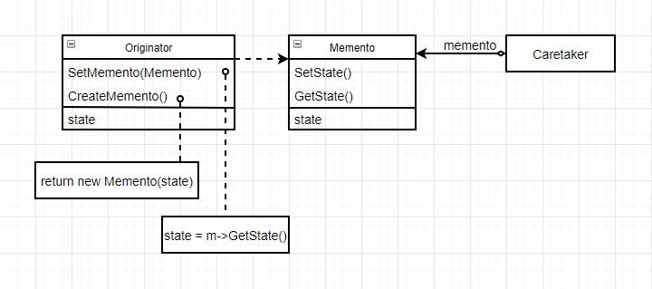
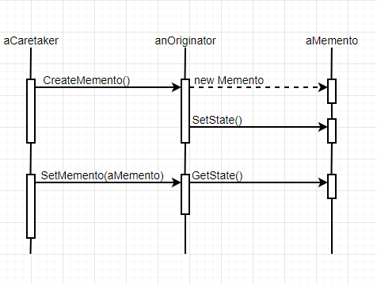

# 备忘录（Memento）

### 意图

在不破坏封装性的前提下，捕获一个对象的内部状态，并在该对象之外保存这个状态。这样以后就可以恢复该对象到原先的状态

### 适用性

- 必须保存一个对象在某个时刻的（部分）状态，这样以后需要时它才能恢复到先前的状态
- 如果一个接口让其他对象直接得到这些状态，将会暴露对象的实现细节并破坏对象的结构

### 结构



### 参与者

- Memento：
  - 存储原发器对象的内部状态，原发器根据需要决定备忘录存储原发器的哪些内部状态
  - 防止原发器以外的对象访问备忘录。备忘录实际上有管理者（Caretaker）看到的**窄接口**——只能将备忘录传递给其他对象，和原发器看到的**宽接口**——允许访问回到先前状态所需的所有数据

- Originator：
  - 创建一个备忘录，用以记录当前时刻它的内部状态
  - 使用备忘录回复内部状态
- Caretaker：
  - 负责保存备忘录
  - 不能对备忘录的内容进行操作和检查

### 协作

- 管理者像原发器请求一个备忘录，保留一段时间后再送回给原发器

  

- 备忘录是**被动的**，只有创建它的原发器会对它的内部状态进行赋值和检索

### 效果

优点：

- 保持封装边界：使用备忘录可以避免暴露一些只应由原发器管理却又必须存储在原发器之外的信息
- 简化了原发器：让客户管理请求的状态，并使得客户工作结束时无需通知原发器

缺点：

- 使用备忘录的代价可能很高：如果备忘录中拷贝并存储了原发器的大量信息，客户频繁创建备忘录和恢复原发器可能会导致非常大的开销
- 定义窄接口和宽接口：一些语言难以保证只有原发器能访问备忘录的状态
- 维护备忘录的潜在代价：管理者负责删除它所维护的备忘录，但管理者不知道备忘录中有多少状态，所以一个本来很小的管理者可能会产生大量存储开销

### 实例

再进行一些危险操作，比如更新系统时，我们希望在更新失败的时候能狗恢复至更新前的状态。可以创建一个系统的快照：

```c++
class Snapshot {
public:
    ~Snapshot();
private:
    friend class System;
    
    Snapshot();
    void SetState(State*);
    State* GetState();
private:
    State* _state;
};

void Snapshot::SetState(State* s) {
    _state = s;
}

State* Snapshot::GetState() {
    return _state;
}
```

```c++
class System {
public:
    System();
    
    Snapshot* CreateSnapshot();
    void SetSnapshot(Snapshot*);
    
    bool Update();
    
    // 其他系统操作...
private:
    State* _state;
    
    // 其他系统变量...
};

Snapshot* System::CreatSnapshot() {
    Snapshot* sp = new Snapshot;
    sp->SetState(_state);
    return sp;
}

void System::SetSnapshot(Snapshot* sp) {
    _state = sp->GetState();
}
```

更新命令负责管理快照：

```c++
class UpCommand {
public:
    UpCommand(System* s) _system(s) {}
    
    void Execute();
private:
    System* _system;
};

void UpCommand::Execute() {
    Snapshot* sp = _system->CreateSnapshot();
    if (!_system->Update()) {
        _system->SetSnapshot(sp);
    }
    delete sp;
}
```

这样就可以进行安全的系统更新操作

### 技巧

1. **语言支持**：为了实现宽接口和窄接口，理想的语言应该可以支持两级的静态保护。在C++中，把Originator作为Memento的一个友元，然后使宽接口是私有的，窄接口是公有的
2. **存储增量式改变**：如果备忘录的创建及返回顺序是可以预测的，备忘录可以仅存储内部状态的变化量，而不是全部内部状态