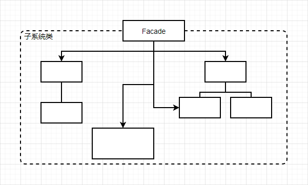

# 外观（Facade）

### 意图

为子系统中的一组接口提供一个一致的界面，Facade模式定义了一个高层接口，使得子系统更加容易使用

### 适用性

- 为一个复杂子系统提供一个单一接口。子系统往往因为不断演化而变得越来越复杂，facade提供一个简单的缺省视图。对大多数客户来说已经足够，需要更多可定制性的客户可以越过facade层
- 用facade将客户和子系统分离，提高子系统的独立性和可移植性
- 需要构建一个层次结构的子系统时，使用facade模式定义子系统中每层的入口点

### 结构



### 参与者

- Facade：
  - 知道哪些子系统类负责处理请求
  - 将客户的请求代理给适当的子系统对象
- Subsystem classes：
  - 实现子系统功能
  - 处理由Facade对象指派的任务
  - 没有Facade的任何相关信息，即没有指向Facade的指针

### 协作

- 客户程序通过发送请求给Facade与子系统通信，Facade将这些信息转发给适当的子系统对象。尽管是子系统对象在做实际工作，Facade模式本身也必须将它的接口转换成子系统的接口
- 使用Facade的客户程序不需要直接访问子系统对象

### 效果

- 对客户屏蔽子系统组件，使子系统用起来简单方便
- 实现了子系统与客户之间的松耦合关系
- 并不限制客户使用子系统类，可以在系统易用性和通用性之间选择

### 实现

在使用DLX求解数独问题的程序中，客户需要先用Conventer类把一个数独问题转换为DLX，求解该DLX再把答案转换为数独，最后使用Printer类打印结果：

```c++
class DLX {
public:
    DLX(int n);
	
    void AddRow(int* r);
    DLX* Solve();
private:
    //...
};
```

```c++
class Conventer {
public:
    Conventer();
    
    DLX* Read(const char* problem);
    const char* Convent(DLX* link);
private:
    //...
};

DLX* Conventer::Read(const char* problem) {
    DLX* d = new DLX;
    
    //...
    
    int* row = new int[324];
    
    //...
    
    d->AddRow(row);
    
    //...
    
    return d;
}
```

```c++
class Printer {
public:
    Printer();
    
    void Print(const char* answer);
private:
    //...
};
```

为了使用方便，创建一个Solver类，提供一个简单的接口用于处理这些操作：

```c++
class Solver {
public:
    Solver();
    
    void Solve(const char* problem);
};

void Solver::Solve(const char* problem) {
    Conventer* c = new Conventer;
    DLX* d = c->Read(problem);
    d = d->Solve();
    ans = c->Convent(d);
    
    Printer* p = new Printer;
    p->Print(ans);
}
```

```c++
const char* problem;

// 输入数独问题...

Solver* s = new Solver();
s->Solve(problem);
```

### 技巧

1. **降低客户—子系统之间的耦合度**：用抽象类实现Facade而它的具体子类对应于不同的子系统实现，可以进一步降低客户与子系统的耦合度；另一种方法是用不同的子系统对象配置Facade对象
2. **公共子系统类与私有子系统类**：子系统的公共接口包含所有的客户程序可以访问的类，私有接口仅用于对子系统进行扩充。（很少有面向对象语言支持私有子系统类）
