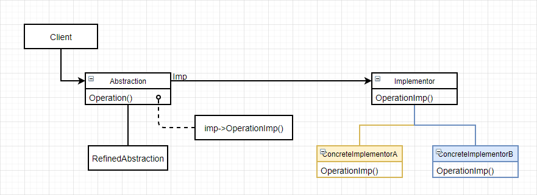

# 桥接（Bridge）

### 意图

将抽象部分与它的实现部分分离，使它们可以独立地变化

### 别名

Handle/Body

### 适用性

- 不希望在抽象和它的实现部分之间有一个固定的绑定关系
- 类的抽象和它的实现都应该可以通过生成子类的方法加以扩充
- 对一个抽象的实现部分的修改应对客户不产生影响
- 相对客户完全隐藏抽象的实现部分
- 有许多类要生成
- 想在多个对象间共享实现，但同时要求客户不知道这一点

### 结构



### 参与者

- Abstraction：
  - 定义抽象类的接口
  - 维护一个指向Implementor类型对象的指针
- RefinedAbstraction：扩充由Abstraction定义的接口（可选）
- Implementor：定义实现类的接口，**该接口不一定要与Abstraction的接口完全一致**，事实上**这两个接口可以完全不同**。一般来讲，Implementor接口仅提供基本操作，而Abstraction则定义了基于这些基本操作的较高层次操作
- ConcreteImplementor：实现Implementor接口并定义它的具体实现

### 协作

Abstraction将Client请求转发给它的Implementor对象

### 效果

1. 分离接口及其实现部分：抽象类的实现可以在运行时进行配置，一个对象甚至可以在运行时改变它的实现。可以降低对实现部分编译时的依赖性，还有助于分层从而产生更好的结构化系统
2. 提高可扩充性：可以独立地对Abstraction和Implementor层次结构进行扩充
3. 实现细节对客户透明：对客户隐藏实现的细节

### 实例

空调可以被原装遥控器或手机遥控器遥控，两种遥控器底层逻辑不同但功能相同。先定义一个遥控器抽象类：

```c++
class RemoteControl {	
public:
    virtual void Open();
    virtual void Close();
    virtual void ChangeMode(int type);
    virtual void ChangeTemp(int temperature);
protected:
    RemoteImp* GetRemoteImp();
private:
    RemoteImp* _imp;
};
```

RemoteControl维护一个RemoteImp的指针，RemoteImp抽象类定义了一个底层逻辑实现的接口：

```c++
class RemoteImp {
public:
    virtual const char SetSignal(int i) = 0;
    virtual void SendSignal(char signal) const = 0;
protected:
    RemoteImp();
};
```

具体的RemoteImp子类支持不同的实现：

```c++
class PhoneRemote : public RemoteImp {
public:
    PhoneRemote();
    
    virtual const char SetSignal(int key)
    	{ return _phone->SignalTable(key); }
    virtual void SendSignal(char signal) const
    	{ _phone->SendSignal(signal); }
private:
    Phone* _phone;
};
```

```c++
class NormalRemote : public RemoteImp {
public:
    NormalRemote();
    
    virtual const char SetSignal(int key)
    	{ return _register[key]; }
    virtual void SendSignal(char signal) const
    	{ Send(signal); }
private:
    char* _register;
};
```

我们注意到RemoteImp的构造函数是受保护的，那么客户该如何得到一个RemoteImp实例呢？使用前面学到的，抽象工厂+单件：

```c++
RemoteImp* RemoteControl::GetRemoteImp() {
    if (_imp == nullptr) {
        _imp = RemoteImpFactory::Instance()->MakeRemoteImp();
    }
    return _imp;
}
```

### 技巧

1. 仅有一个Implementor：在仅有一个实现的时候，没有必要创建一个抽象的Implementor类，这是桥接模式退化的情况
2. 创建正确的Implementor对象：当存在多个Implementor类的时候，应该用何种方法，何时在何处确定创建哪一个Implementor类？
   - 如果Abstraction知道所有ConcreteImplementor类，就可以在它的构造器中通过传参数的方式对某一个类进行实例化
   - 首先选择一个缺省的实现，然后根据需要改变这个实现
   - 代理给另一个对象，由它一次决定（抽象工厂），这样Abstraction类不和任何Implementor类耦合

