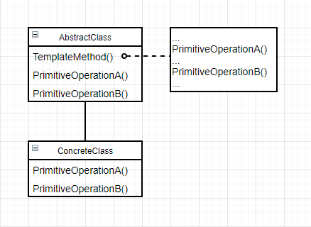

# 模板方法（TemplateMethod）

### 意图

定义一个操作中的算法的骨架，而将一些步骤延迟到子类中，使得子类可以不改变一个算法的结构即可重定义该算法的某些特定步骤

### 适用性

- 一次性实现一个算法的不变部分，并将可变的行为留给子类来实现
- 各子类中公共的行为应被提取出来并集中的一个公共父类中以避免代码重复
- 控制子类扩展：只在特定点调用钩子操作，这样就只允许在这些点进行扩展

### 结构



### 参与者

- AbstractClass：
  - 定义抽象的**原语操作**，具体的子类将重定义它们以实现一个算法的各步骤
  - 实现一个模板方法，定义一个算法的骨架。该模板方法不仅调用原语操作，还调用定义在AbstractClass或其他对象中的操作
- ConcreteClass：实现原语操作以完成算法中与特定子类相关的步骤

### 协作

ConcreteClass靠AbstractClass来实现算法中不变的步骤

### 效果

代码复用的基本技术，导致一种**反向控制结构**：父类调用子类的操作，而不是相反

模板方法调用以下操作：

- 具体的操作（ConcreteClass或对客户类的操作）
- 具体的AbstractClass操作（对子类有用的操作）
- 原语操作（抽象操作）
- FactoryMethod
- **钩子操作**：提供了缺省的行为，子类可以在必要时进行扩展，在缺省的情况下通常是空操作

其中，钩子操作**可以**被重定义，原语操作**必须**被重定义

### 实例

厨师炒菜有一套标准的流程，先准备食材，再放调料然后翻炒，最后装盘（可选）。不按照这个流程就做不出炒饭，但是每一部分可以根据要做的菜的不同自由发挥。这时候就可以用模板方法：

```c++
class Chef {
public:
    Chef();
    
    Food* Cook();
protected:
    virtual Ingredients* makeIng() = 0;
    virtual Seasoning* makeSeas() = 0;
    virtual void putSeas(Ingredient*, Seasoning*) = 0;
    virtual Food* fry(Ingredients*) = 0;
    virtual void Decorate(Food*) {}	// 钩子
};

Food* Chef::Cook() {
    Ingredients* ing = makeIng();
    Seasoning* seas = makeSeas();
    putSeas(ing, seas);
    Food* f = fry(ing);
    Decorate(f);
    return f;
}
```

学徒水平的厨师（比如我）只会做最简单的蛋炒饭：

```c++
class Learner : public Chef {
public:
    Learner();
protected:
    virtual Ingredients* makeIng();
    virtual Seasoning* makeSeas();
    virtual void putSeas(Ingredient*, Seasoning*);
    virtual Food* fry(Ingredients*);
    
    // 没有重写Decorate函数，因为学徒厨师不会装饰
};

Ingredients* Learner::makeIng() {
    // 准备鸡蛋和隔夜米饭，还有快乐火腿肠
    Ingredients* rice = MakeRice();
    Ingredients* egg = MakeEgg();
    Ingredients* hamSausage = MakeHamSausage();
    Ingredients* mixture = Mix(rice, egg, hamSausag);
    
    return mixture;
}

Seasoning* Learner::makeSeas() {
    // 准备盐和油
    Seasoning* salt = MakeSalt();
    Seasoning* oil = MakeOil();
    Seasoning* mixture = Mix(salt, oil);
    
    return mixture;
}

void Learning::putSeas(Ingredient* ing, Seasoning* seas) {
    // 全放到一起
    ing.Add(seas);
}

Food* Learning::fry(Ingredient* ing) {
    // 炒熟就行
}
```

现在学徒也可以根据流程做出蛋炒饭：

```c++
Learner* me = new Learner;
Food* f = me->Cook();	// f是一碗朴实蛋炒饭
```

### 技巧

1. **访问控制**：在C++中，一个模板方法调用的原语操作可以被定义为保护成员函数，保证它们只被模板方法调用
2. **尽量减少原语操作**：需要重定义的操作越多，客户程序就越冗长
3. **命名约定**：可以给应该被重定义的操作的名字加上一个前缀以识别它们

