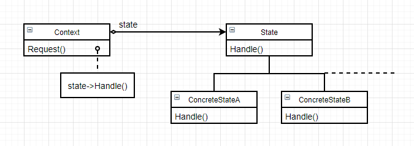

# 状态（State）

 ### 意图

允许一个对象在其内部状态改变时改变它的行为，使对象看起来似乎是修改了它的类

### 别名

状态对象（object of state）

### 适用性

以下两种情况**均**可使用状态模式：

- 一个对象的行为取决于它的状态，并且它必须在运行时根据状态改变它的行为
- 一个操作中含有庞大的多分支的条件语句，且这些分支依赖于对该对象的状态。通常有多个操作包含这一相同的条件结构。State模式将每一个条件分支放入一个独立的类中，将对象的状态作为一个对象，这一状态对象不依赖于其他对象独立变化

### 结构



### 参与者

- Context：
  - 定义客户感兴趣的接口
  - 维护一个ConcreteState实例，这个实力定义当前状态
- State：定义一个接口以封装与Context的一个特定状态相关的行为
- ConcreteState：每一个子类实现一个与Context的一个状态相关的行为

### 协作

- Context将与自身状态相关的请求委托给当前的ConcreteState对象处理
- Context可将自身作为一个参数传递给处理该请求的状态对象。这使得状态对象在必要时可访问Context
- Context是客户使用的主要接口，客户可用状态对象来配置Context，一旦一个Context配置完毕，它的客户不再需要直接与状态对象打交道
- Context和ConcreteState子类都可决定哪个状态是另外一个的后继者，以及是在何种条件下进行状态转换

### 效果

1. 将与特定状态相关的行为局部化，并且将不同状态的行为分割开来：通过定义新的子类可以很容易地增加新的状态和转换，**问题**是引入了新的子类
2. 使状态转换显式化：使转换变得更加明确，且保证了Context内部的一致性（只需要改变ConcreteState一个变量，无需对多个变量赋值）
3. State对象可被共享：如果State对象没有实例变量，那么各Context对象可以共享State对象（单件和享元模式）

### 实例

汽车人有人形态和车形态，两种形态拥有不同的行为方式，但始终是一个汽车人。

```c++
class Carman {
public:
    Carman();
    
    void Move(Point& p) { _state->Move(this, p); }
    void Speak(const char* w) { _state->Speak(this, w); }
    void ChangeState(CarmanState* s) { _state = s; }
    
    // 其他变形金刚操作...
private:
    CarmanState* _state;
    
    // 其他汽车人变量...
};
```

通过一个`CarmanState`变量指定汽车人的形态：

```c++
class CarmanState {
public:
    virtual void Move(Carman*, Point);
    virtual void Speak(Carman*, const char*);
    virtual void ChangeState(Carman* c, CarmanState* s)
    	{ c->ChangeState(s); }
    
    // 其他变形金刚操作...
};
```

```c++
class CarState : public CarmanState {
public:
    CarState();
    
    virtual void Move(Carman*, Point);
    virtual void Speak(Carman*, const char*);
    
    // 其他变形金刚操作...
};

void CarState::Move(Carman* c, Point p) {
    Point location = c->Locate();
    while (location != p) {
        // 汽车形态用轮胎移动
        c->DriveWheel(p);
        location = c->Locate();
    }
}

void CarState::Speak(Carman* c, const char* word) {
    // 汽车形态用收音机说话
    c->Radio(word);
}
```

```c++
class ManState : public CarmanState {
public:
    ManState();
    
    virtual void Move(Carman*, Point);
    virtual void Speak(Carman*, const char*);
    
    // 其他变形金刚操作...
};

void ManState::Move(Carman* c, Point p) {
    Point location = c->Locate();
    while (location != p) {
        // 人形态用脚移动
        c->DriveFeet(p);
        location = c->Locate();
    }
}

void ManState::Speak(Carman* c, const char* word) {
    // 人形态用嘴说话
    c->Mouse(word);
}
```

现在就可以汽车人变形了：

```c++
CarState* car = new CarState;
ManState* man = new ManState;

Carman* cm = new Carman;
cm->ChangeState(car);
cm->Move(Point(100, 20));
cm->Speak("汽车人变形！");
cm->ChangeState(man);
cm->Speak("我直接用嘴说话");
```

### 技巧

1. **谁定义状态转换**：State模式并不指定哪个参与者定义状态转换准则。 如果准则是固定的，可以在Context中完全实现；而在State子类中指定它们的后继状态会更灵活、更易于扩展，但是耦合性更强
2. **基于表的另一种方法**：使用表将输入映射到状态转换，将条件代码映射为一个查找表。这种方法的好处在于**规则性**，但有以下缺点：
   - 表的查找效率低于函数调用
   - 使逻辑转换准则不明确而难以理解
   - 难以加入伴随状态转换的一些动作
3. **创建和销毁State对象**：如果状态不经常改变，就仅在需要时创建并随时销毁它们；如果经常发生状态改变，就在开始时创建它们，并在最后统一销毁
4. **使用动态继承**：基于委托的语言直接支持State模式
