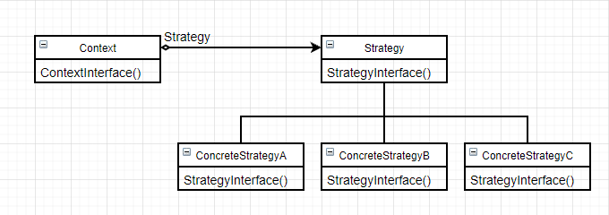

# 策略（Strategy）

### 意图

定义一系列算法，把它们一个个封装起来，并且使它们可以相互替换；使算法可独立于使用它的客户而变化

### 别名

政策（Policy）

### 适用性

- 许多相关的类仅仅是行为不一样，策略模式可以用多个行为中的一个来配置一个类
- 需要使用一个算法的不同变体
- 算法使用客户不应该知道的数据
- 一个类定义了多种行为，并且这些行为在这个类的操作中以多个条件语句的形式出现

### 结构



### 参与者

- Context：
  - 用一个ConcreteStrategy对象配置
  - 维护一个对Strategy对象的引用
  - 可定义一个接口来让Strategy访问它的数据
- Strategy：定义所有支持的算法的公共接口，Context使用这个接口来调用ConcreteStrategy定义的算法
- ConcreteStrategy：以Strategy接口实现具体算法

### 协作

- Strategy和Context相互作用以实现选定的算法。当算法被调用时Context提供给Strategy必要的数据或将自身传递给Strategy
- Context把客户请求转发给它的Strategy

### 效果

优点：

- 相关算法系列：Strategy为Context提供了一系列可供复用的算法或行为，策略有助于析取出这些算法中的公共功能
- 一个替代继承的方法：提供了另一种支持多种算法或行为的方法，易于切换、理解和扩展
- 消除了一些条件语句：不同的行为堆砌在一个类中时很难避免使用条件语句来选择合适的行为，将行为封装成独立的策略可以消除这些条件语句

- 实现的选择：可以提供相同行为的不同实现，客户可以选择一种

缺点：

- 客户必须了解不同的Strategy：客户必须知道Strategy到底有何不同，可能必须暴露具体信息。因此**仅当这些不同行为的变体与客户相关时，才需要使用Strategy模式**
- Strategy和Context之间的通信开销：传参数的方法会导致传递一些ConcreteStrategy用不到的参数，传Context的方法会导致Context和Strategy之间更紧密的耦合
- 增加了对象的数目：可以用享元模式减小这一开销

### 实例

鲨手的目的是鲨人，但是根据各种情况鲨人的手段也不同，但最终目的就是鲨

```c++
class Hitman {
public:
    Hitman();
    
    bool Kill(const char* name)
    	{ _strategy->Do(name); }
    void Plan(Strategy* s)
    	{ _strategy = s; }
private:
    Strategy* _strategy;
};
```

我们可以定义几种不同的鲨人策略，比如下毒、刀了和制造意外：

```c++
class Strategy {
public:
    virtual bool Do(const char*) = 0;
protected:
    Strategy();
};
```

```c++
class Poison : public Strategy {
public:
    Poison();
    
    virtual bool Do(const char*);
};

bool Posion::Do(const char* target) {
    // 用毒药鲨人...
    // 返回是否成功毒人
}
```

```c++
class Knife : public Strategy {
public:
    Knife();
    
    virtual bool Do(const char*);
};

bool Knife::Do(const char* target) {
    // 用刀鲨人...
    // 返回是否成功刀人
}
```

```c++
class Accident : public Strategy {
public:
    Accident();
    
    virtual bool Do(const char*);
};

bool Accident::Do(const char* target) {
    // 制造意外鲨人...
    // 返回是否成功意外死亡
}
```

现在可以针对不同的人选择不同的策略：

```c++
Hitman no47 = new Hitman;

// 对干饭人下毒
no47.Plan(new Poison);
no47.Kill("Food Man");

// 对凤凰战士用刀
no47.Plan(new Knife);
no47.Kill("Phoenix");

// 对政要制造意外
no47.Plan(new Accident);
no47.Kill("Government VIP");
```

### 技巧

1. **定义Strategy和Context接口**：Strategy和Context接口必须使得ConcreteStrategy能更有效地访问它所需要的Context中的任何数据，反之亦然
2. **将Strategy作为模板参数**：可以利用模板机制用一个Strategy来配置一个类，但是只有满足以下两点：①可以在编译时选择Strategy；②不需要在运行时改变
3. **使Strategy对象成为可选的**：可以定义一个缺省的行为，在没有配置特定Strategy的时候Context执行缺省行为
