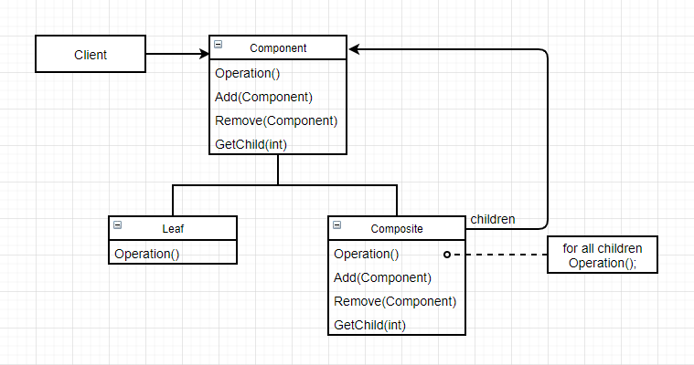

# 组合（Composite）

### 意图

将对象组合成树形结构以表示 “部分—整体” 的层次结构。Composite使得用户对单个对象和组合对象的使用具有一致性

### 适用性

- 想表示对象的部分—整体层次结构
- 希望用户忽略组合对象与单个对象的不同， 统一地使用组合结构中的所有对象

### 结构



### 参与者

- Component：
  - 为组合中的对象声明接口
  - 在适当的情况下，实现所有类共有接口的缺省行为
  - 声明一个接口用于访问和管理Component的子组件
  - （可选）在递归结构中定义一个接口，用于访问一个父部件，并在合适的情况下实现它
- Composite：
  - 定义有子部件的那些部件的行为
  - 存储子部件
  - 在Component接口中实现与子部件有关的操作
- Leaf：
  - 在组合中表示叶结点对象，叶结点没有子结点
  - 在组合中定义图元对象的行为
- Client：通过Component接口操纵组合部件的对象

### 协作

用户使用Component类接口与组合结构中的对象进行交互。如果接收者是一个叶结点，则直接处理请求；如果接收者是Composite，它通常将请求发送给它的子部件，在转发请求前和/或之后可能执行一些辅助操作

### 效果

- 定义了包含基本对象和组合对象的类层次结构：基本对象可以被组合成更复杂的组合对象，而这个组合对象又可以被组合，这样一直递归下去
- 简化客户代码：客户可以一致地使用组合结构和单个对象
- 使得更容易增加新类型的组件：新定义的Composite或Leaf子类自动地与已有的结构和客户代码一起工作，客户程序不需要因为新的Component而改变
- 是你的设计变得更加一般化：容易增加新组件也会产生一个问题，很难闲置组合中的组件。有时希望组合中只有某些特定的组件，则必须在运行时进行检查

### 实例

在一个游戏中需要生成并使用迷宫，基础迷宫由最基础的房间和路组成，而基础迷宫又能组成更复杂的迷宫，并以此类推。如何统一地使用不同层次的迷宫？

使用组合（Component），先为所有迷宫结构声明一个接口：

```c++
class Maze {
public:
    virtual ~Maze();
    
    const char* Name() const { return name; }
    
    virtual int Size() const;
    virtual bool IsSafe() const;
    
    virtual void Add(Maze* m);
    virtual void Remove(Maze* m);
    virtual Iterator<Maze*>* CreateIterator();
protected:
    Maze(const char* n) : name(n) {};
private:
    const char* name;
};
```

接着是Maze的Leaf子类：

```c++
class Room : public Maze {
public:
    Room(const char* n, const int sz, const bool sf)
        : name(n), size(sz), safe(sf) {}
    virtual ~Room();
    
    virtual int Size() const { return size; }
    virtual bool IsSafe() const { return safe; }
private:
    int size;
    bool safe;
};
```

```c++
class Road : public Maze {
public:
    Road(const char* n, const int sz, const bool sf)
        : name(n), size(sz), safe(sf) {}
    virtual ~Road();
    
    virtual int Size() const { return size; }
    virtual bool IsSafe() const { return safe; }
private:
    int size;
    bool safe;
};
```

CompositeMaze包含其他迷宫的基类，它也是Maze的子类：

```c++
class CompositeMaze : public Maze {
public:
    virtual ~CompsiteMaze();
    
    virtual int Size() const;
    virtual bool IsSafe() const;
    
    virtual void Add(Maze *m);
    virtual void Remove(Maze *m);
    virtual Iterator<Maze*>* CreateIterator();
protected:
    CompositeMaze(const char* n) : name(n) {}
private:
    List<Maze*> _maze;
};
```

其中`Size()`和`IsSafe()`函数的缺省实现是遍历_maze列表并调用其中的`Size()`和`IsSafe()`函数：

```c++
int CompositeMaze::Size() const {
    Iterator<Maze*>* iter = CreateIterator();
    int sz = 0;
    
    for (iter->First(); !iter->IsDone(); iter->Next()) {
        sz += iter->CurrentItem()->Size();
    }
    delete iter;
    return sz;
}
```

```c++
bool CompositeMaze::IsSafe() const {
    Iterator<Maze*>* iter = CreateIterator();
    bool safe = false;
    
    for (iter->First; !iter->IsDone(); iter->Next()) {
        safe ||= iter->CurrentItem()->IsSafe();
    }
    delete iter;
    return safe;
}
```

现在我们将迷宫的一部分表示为CompositeMaze的子类HomeMaze，继承其与子类有关的操作：

```c++
class HomeMaze : public CompositeMaze {
public:
    HomeMaze(cosnt char* n) : name(n) {}
    virtual ~HomeMaze();
    
    virtual bool Safe() const { return true; }
};
```

这样就可以统一地对各种迷宫进行操作：

```c++
HomeMaze* guest = new HomeMaze("guestroom");
guest->Add(new Room("toliet", 1, true));
guest->Add(new Room("bedroom", 1, true));

HomeMaze* home = new HomeMaze("Majula");
home->Add(guest);
home->Add(new Room("warehose", 10, true));

// "The size of Majula is 12"
cout << "The size of "<< home->Name() << " is " << home->Size() << endl;
```

### 技巧

1. **显示的父部件引用**：保持从子部件到父部件的引用能简化组合结构的遍历和管理。通常在Component类中定义父部件引用，Leaf和Composite类继承。对于父部件引用，必须维护不变式（一个组合的所有子结点都以它为父结点，他以所有这些结点为子结点），在Composite类的Add和Remove中实现这种方法，则所有的子类都可以继承，并且自动维护这一不变式

2. **共享组件**：共享组件很有用，但是当一个组件只有一个父组件时就很难共享。一个解决方法是为子组件存储多个父组件，这种方法需要**Flyweight**模式

3. **最大化Component接口**：为Leaf和Composite类尽可能多定义一些公共操作。Component类通常可以定义缺省的实现，Leaf和Composite可以对它们重定义

4. **声明管理子部件的操作**：需要在安全性和透明性之间做出抉择

   - 在类层次结构的根部定义子结点管理接口的方法具有良好的透明性，但会损失安全性， 因为用户可能做一些无意义的事，比如在Leaf中增加和删除对象
   - 在Composite类中定义管理子部件的方法具有良好的安全性，但Leaf和Composite有不同的接口，所以损失了透明性

   一种方法是在Component类中声明一个`Composite* GetComposite()`，并提供一个返回空指针的缺省操作。Composite重新定义该操作并通过this指针返回自己

5. **Component是否应该实现一个Component列表**：因为Leaf类没有子类，所以会造成空间浪费。只有当结构中子类数目相对较少时，才值得使用这种方法

6. **子部件排序**：如果需要考虑子结点的顺序，必须仔细地设计对子结点的访问和管理接口，可以参考**Iterator**模式

7. **使用高速缓冲存储改善性能**：如果需要对组合进行频繁的遍历或查找，Composite可以缓冲存储相关信息。但是需要定义一个接口来通知组合组件他们所缓冲的信息无效（子组件发生变化）

8. **应该由谁删除Component**：通常最好由Composite负责删除其子结点，但有一种**例外**：Leaf对象不会改变，因此可以被共享

