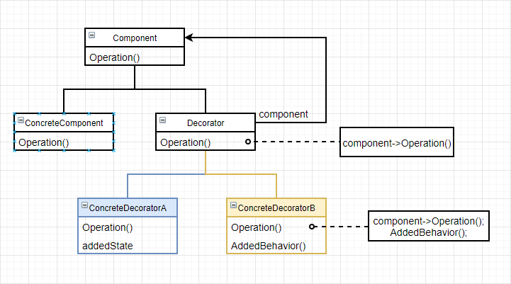

# 装饰（Decorator）

### 意图

动态地给一个对象添加额外的职责。比生成子类更加灵活

### 别名

包装器（wrapper）

### 适用性

- 在不影响其他对象的情况下，以动态、透明的方式给单个对象添加职责
- 处理那些可撤销的职责
- 当不能以生成子类的方法扩充时（有大量独立地扩展，会发生子类数目爆炸；或者类的定义被隐藏/定义不能用于生成子类）

### 结构



### 参与者

- Component：定义一个对象接口，可以给这些对象动态地添加职责
- ConcreteComponent：定义一个对象，可以给这个对象添加职责
- Decorator：维持一个指向Component对象的指针，并定义一个与Component接口一致的接口
- ConcreteDecorator：向组件添加职责

### 协作

Decorator把请求转发给它的Component对象，并可能在转发请求前后执行一些附加操作

### 效果

优点：

- 比静态继承更灵活：提供了更加灵活地向对象添加职责的方式，也可以很容易重复添加一个特性
- 避免在层次结构高层的类有太多特性：可以从简单的部件组合出复杂的功能，不用在一个复杂的可定制的类中支持所有可预见的特性

缺点：

- Decorator与它的Component不一样：使用装饰时不应该依赖对象标识
- 有许多小对象：会产生仅仅在相互连接方式上有所不同，而不是类或属性值不同的小对象。程序可读性下降

### 实例

File类用来打开或关闭文件：

```c++
class File {
public:
    File(int f) : _file(f) {}
    
    virtual void Open();
    virtual void Close();
    
    //...
    
private:
    int _file;
};
```

现在需要操作被压缩过的文件，该怎么办？用装饰模式，先定义一个Decorator，其接口和File类一致：

```c++
class FileDecorator {
public:
    FileDecorator(File* f) : _file(f) {}
    
    virtual void Open();
    virtual void Close();
    
    //...
    
private:
    File* _file;
};
```

根据不同的压缩文件类型，定义不同的Decorator子类：

```c++
class ZipFile : public FileDecorator {
public:
    ZipFile(File* f) : _file(f) {}
    
    virtual void Open();
    virtual void Close();
    
    //...
    
private:
    void zip();
    void unzip();
    
    File* _file;
};

// 在转发请求前/后进行一些操作
void ZipFile::Open() {
    unzip();
    _file->Open();
}

void ZipFile::Close() {
    _file->Colse();
    zip();
}
```

```c++
class RarFile : public FileDecorator {
public:
    RarFile(File* f) : _file(f) {}
    
    virtual void Open();
    virtual void Close();
    
    //...
    
private:
    void rar();
    void unrar();
    
    File* _file;
};

// 在转发请求前/后进行一些操作
void RarFile::Open() {
    unrar();
    _file->Open();
}

void RarFile::Close() {
    _file->Close();
    rar();
}
```

这样就可以在使用时动态地给对象添加职责：

```c++
// 操作zip格式压缩文件
ZipFile zf(new File(1));
zf.Open();
//...
zf.Close();

// 操作rar格式压缩文件
RarFile rf(new File(2));
rf.Open();
//...
rf.Close();
```

### 技巧

1. **接口的一致性**：装饰对象的接口必须与它所装饰的Component的接口是一致的，因此所有的ConcreteDecorator类必须有一个公共的父类
2. **省略抽象的Decorator类**：当你仅需要添加一个职责时，没必要定义抽象Decorator类
3. **保持Component类的简单性**：公共的Component父类应集中于定义接口而不是存储数据，对数据表示的定义应延迟到子类
4. **改变对象外壳和改变对象内核**：装饰模式改变对象的外壳，还有一种**策略模式**改变对象的内核。当Component类原本就很庞大时，策略模式会比较好

