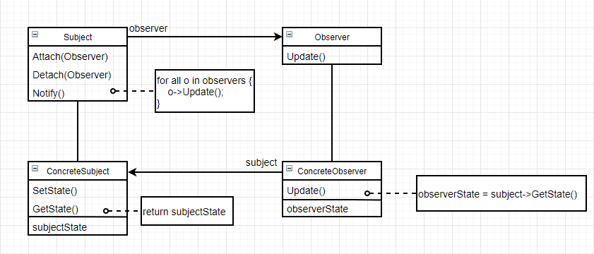
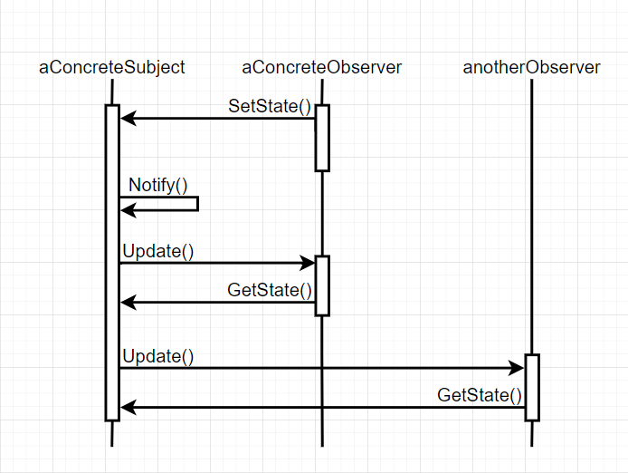

# 观察者（Observer）

### 意图

定义对象间的一种一对多的依赖关系，当一个对象的状态发生改变时，所有依赖它的对象都得到通知并被自动更新

### 别名

依赖（dependent）、发布—订阅（publish-subscribe）

### 适用性

- 一个抽象的模型有两个方面，其中一个方面依赖于另一方面。将这二者封装在独立的对象中，以使它们可以独自地改变和复用
- 对一个对象的改变需要同时改变其他对象，而不知道具体有多少对象待改变
- 一个对象必须通知其他对象，而又不能假定其他对象是谁

### 结构



### 参与者

- Subject：
  - 目标知道它的观察者，可以有任意多个观察者观察同一个目标
  - 提供注册和删除观察者对象的接口
- Observer：为那些在目标发生改变时需要获得通知的对象定义一个更新接口
- ConcreteSubject：
  - 将有关状态存入各ConcreteObserver对象
  - 状态发生改变时，向观察者发出通知
- ConcreteObserver：
  - 维护一个指向ConcreteSubject对象的引用
  - 存储有关状态，这些状态应该与目标状态保持一致
  - 实现Observer更新接口

### 协作

- ConcreteSubject发生任何改变时，通知观察者
- ConcreteObserver收到通知后，向ConcreteSubject查询消息，以使自身和目标的状态保持一致



### 效果

优点：

- 目标和观察者间的抽象耦合：目标不知道任何一个观察者属于哪个具体的类，这样目标和观察者之间的耦合是抽象的和最小的，它们可以处于一个系统中的不同抽象层次
- 支持广播通信：拥有时刻增加和删除观察者的自由，处理还是忽略一个通知取决于观察者

缺点：

- 意外的更新：因为观察者之间不知道彼此的存在，所以它可能不知道改变目标会导致什么结果，一个在目标上看似无害的操作可能会引起一系列对观察者以及依赖于这些观察者的对象的更新

### 实例

一个网站上有很多视频博主，如果你喜欢一个博主的视频可以成为他的粉丝，之后网站会及时通知你该播主投稿了新视频。这里需要用到观察者模式：

```c++
class Observer {
public:
    virtual ~Observer();
    virtual void Update(Subject* theChangeSubject) = 0;
protected:
    Observer();
};
```

```c++
class Subject {
public:
    virtual ~Subject();
    
    virtual void Attach(Observer*);
    virtual void Detach(Observer*);
    virtual void Notify();
protected:
    Subject();
private:
    List<Observer*>* _observers;
};

void Subject::Attach(Observer* o) {
    _observers->Append(o);
}

void Subject::Detach(Observer* o) {
    _observers->Remove(o);
}

void Subject::Notify() {
    ListIterator<Observer*> iter(_observer);
    
    for (iter.First(); !iter.IsDone(); iter.Next()) {
        iter.CurrentItem()->Update(this);
    }
}
```

我们把博主作为Subject，粉丝作为Observer。注意和传统观察者模式不同，粉丝自身也维护一个关注的博主列表：

```c++
class Blogger : public Subject {
public:
    Blogger(const char* n) : _name(n) {}
    
    void Upload(Video*);
    const char* GetName() const;
    ListIterator<Video*> GetVideos() const;
    
    // 其他博主操作...
    
private:
    const char* _name;
    List<Video*>* _videos;
};

void Blogger::Upload(Video* v) {
    // 上传视频...
    _videos->Append(v);
    Notify();
}

const char* Blogger::GetName() const {
    return _name;
}

ListIterator<Video*> GetVideos() const {
    return ListIterator<Video*>(_videos);
}
```

```c++
class Fan : public Observer {
public:
    Fan(const char* n) : _name(n) {}
    
    virtual void Subscribe(Blogger*);
    virtual void Unsubscribe(Blogger*);
    virtual void Update(Subject*);
    
    // 其他粉丝操作...
    
private:
    const char* _name;
    List<Blogger*>* _bloggers;
};

void Fan::Subscribe(Blogger* b) {
    _bloggers->Append(b);
    b->Attach(this);
    printf("已成功关注%s\n", b->GetName());
}

void Fan::Unsubscribe(Blogger* b) {
    _bloggers->Remove(b);
    b->Detach(this);
    printf("已取消关注%s\n", b->GetName());
}

void Fan::Update(Subject* theChangeSubject) {
    ListIterator<Video*> iter = theChangeSubject->GetVideos();
    Video* newVideo = iter.Last()->CurrentItem();
    printf("你关注的博主：%s 刚刚发布了新视频：%s\n", theChangeSubject->GetName(), newVideo->Name());
}
```

现在就可以及时通知所有粉丝他们关注博主的更新情况：

```c++
Blogger* sun = new Blogger("Sun");
Video* v = new Video("Come here!");

Fan* sunKnight = Fan("SunKnight");
f.Subscribe(sun);

b.Upload(v);
```

上面代码运行的结果：

```c++
已成功关注Sun
你关注的博主：Sun 刚刚发布了新视频：Come here！
```

### 技巧

1. **创建目标到其观察者之间的映射**：可以用一个关联查找机制（如hash表）来维护目标到观察者的映射，这样没有观察者的目标就不产生存储开销

2. **观察多个目标**：在某些情况下，一个观察者可以依赖与多个目标。这种情况下，观察者需要知道是哪个目标送来了通知，目标对象可以简单地将自己作为Update的参数

3. **谁触发更新**：哪个对象用`Notify`来触发更新

   - 对象改变状态后自动调用Notify：优点是客户无需记住在目标对象上调用Notify，缺点是多个连续操作会产生多次连续更新导致效率降低
   - 客户在适当的时候调用Notify：优点是客户可以在一系列的状态改变完成后一次性更新，缺点是给客户增加了触发更新的责任

4. **对已删除目标的悬挂引用**：一个目标被删除时应该通知它的观察者们将对该目标的引用复位

5. **在发出通知前确保目标的状态自身是一致的**：因为观察者会查询目标当前的状态

6. **避免特定于观察者的更新协议—推/拉模型**：推模型复用性较差，因为目标需要假设观察者需要知道什么信息；拉模型效率较低，因为观察者要在没有目标帮助的情况下确定什么改变了

7. **显示地指定感兴趣的改变**：扩展目标的注册接口，让观察者注册为仅对特定事件感兴趣，当一个事件发生时仅通知那些感兴趣的观察者。一种实现方法是**方面（aspect）**概念

   ```c++
   void Subject::Attacn(Observer*, Aspect& interest);
   void Observer::Update(Subject*, Aspect& interest);
   ```

8. **封装复杂的更新语义**：当目标和观察者之间的依赖关系很复杂时可以设置一个**更改管理（ChangeManager）**处理以下事件

   - 将一个目标映射到它的观察者并提供一个接口来维护这个映射，这样目标和观察者之间就不用维护对方的引用
   - 定义一个特定的更新策略
   - 根据一个目标的请求，更新所有依赖于这个目标的观察者

9. **结合目标类和观察者类**：定义一个既是目标类又是观察者类的类
