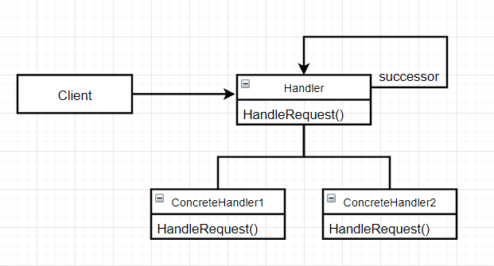
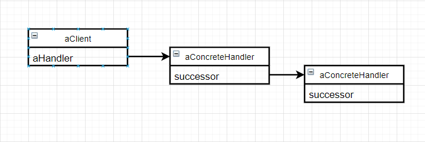

# 责任链（Chain of Responsibility）

### 意图

使多个对象都有机会处理请求，从而避免请求的发送者和接收者之间的耦合关系。将这些对象连成一条链，并沿着这条链传递请求，知道有一个处理它为止

### 适用性

- 有多个对象可以处理一个请求，哪个对象处理该请求运行时自动确定
- 想在不明确指定接受者的情况下，向多个对象中的一个提交一个请求
- 可处理一个请求的对象集合应被动态指定

### 结构



一个典型的责任链对象结构如下：



### 参与者

- Handler：
  - 定义一个处理请求的接口
  - （可选）实现后继链
- ConcreteHandler：
  - 处理它所负责的请求
  - 可访问它的后继者
  - 如果可处理请求，就处理；否则将请求转发给它的后继者
- Client：向链上的具体处理者对象提交请求

### 协作

当客户提交一个请求时，请求沿链传递直至有一个ConcreteHandler对象负责处理它

### 效果

优点：

- 降低耦合度：一个对象无须知道是其他哪个对象处理其请求，对象仅知道该请求会被“正确”处理。职责链可以简化对象的相互连接，它们仅需要保持一个指向后继者的引用
- 增强给对象指派职责的灵活性：可以通过在运行时对该链进行动态的增加或修改来增加或改变处理一个请求的那些职责

缺单：

- 不保证被接受：请求没有明确的接收者，所以不能保证一定会被处理

### 实例

想象你要去政府部门办事：

```c++
typedef int Level;
const Level NO_LEVEL = -1;

class Office {
public:
    Office(Office* suc, Level l) : _successor(suc), _level(l) {}
    
    virtual bool CanHandle();
    virtual void Handle();
    virtual void SetHandler();
private:
    Office* _successor;
    Level _level;
};

bool Office::CanHandle() {
    return _level != NO_LEVEL;
}

void Office::Handle() {
    if (_successor != nullptr) {
        _successor->Handle();
    }
}
```

首先去了街道办，然后街道办说：“你这个事情不归我们管，找当地人才中心解决。”

```c++
class Street : public Office {
public:
    Street(Office* o, Level l = NO_LEVEL);
    
    virtual void Handle();
    
    // Street的其他操作...
};

void Street::Handle() {
    if (CanHandle()) {
        // 解决问题...
    } else {
        Office::Handle();
    }
}
```

到当地人才中心之后，人才中心说：“我们没有权限，只有教育局可以处理。”

```c++
class HumeanCenter : public Office {
public:
    HumeanCenter(Office* o, Level l = NO_LEVEL);
    
    virtual Handle();
    
    // HumeanCenter的其他操作...
};

void HumeanCenter::Handle() {
    if (CanHandle()) {
        // 解决问题...
    } else {
        Office::Handle();
    }
}
```

最后，你在教育局解决了问题。

```c++
class EducationBureau : public Office {
public:
    EducationBureau(Level l) : _level(l) {}
    
    virtual void Handle();
};

void EducationBureau::Handle() {
    // 解决问题...
}
```

整个流程如下：

```c++
const Level STREET_LEVEL = 1;
const Level HUMEAN_CENTER_LEVEL = 2;
const Level EDUCATION_BUREAU_LEVEL = 3;

EducationBureau* e = new EducationBureau(EDUCATION_BUREAU_LEVEL);
HumeanCenter* h = new HumeanCenter(e, HUMEAN_CENTER_LEVEL);
Street* s = new Street(s, STREET_LEVEL);

s->Handle();
```

### 技巧

1. **实现后继者链**（两种方法）：
   - 定义新的链接（通常在Handler中定义，但也可以由ConcreteHandler定义）
   - 使用已有链接

2. **连接后继者**：如果没有已有的引用可以定义一个链，那么你必须自己引入它们。这种情况下Handler不仅定义该请求的接口，通常也维护后继者。这样Handler就提供了HandleRequest的默认实现：向后继者转发请求。ConcreteHandler子类可以重定义转发操作
3. **表示请求**：
   - 最简单的方式：请求是一个硬编码的操作调用。这种方式简单且安全，但只能转发Handler类定义的固定的一组请求
   - 使用一个处理函数：该函数以一个请求码（通常是数字或字符串）为参数。更为灵活，但需要用条件语句区分请求代码以分配请求，另外，无法用类型安全的方法来传递请求参数，所以它们必须被手工打包和解包，很不安全
   - 使用独立的请求对象来封装请求参数：定义一个Request类，新的类型请求可以用它的子类定义。为了知道请求的类型，Request可以定义一个访问器以说明自身的类型
