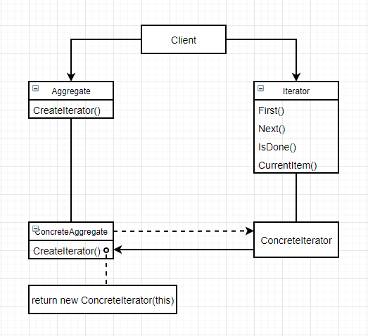

# 迭代器（Iterator）

### 意图

提供一种方法顺序访问一个集合对象中的各个元素，而又不需要暴露该对象的内部表示

### 适用性

- 访问一个聚合对象的内容而无需暴露它的内部表示
- 支持对聚合对象的多种遍历
- 为遍历不同的聚合结构提供一个统一的接口（即支持多态迭代）

### 结构



### 参与者

- Iterator：定义访问和遍历元素的接口
- ConcreteIterator：
  - 具体实现迭代器接口
  - 对该聚合遍历时跟踪当前位置
- Aggregate：定义创建相应迭代器对象的接口
- ConcreteAggregate：实现创建相应迭代器的接口，该操作返回ConcreteIterator的一个适当的实例

### 协作

ConcreteIterator跟踪聚合中的当前对象，并能够计算出待遍历的后继对象

### 效果

1. 支持以不同的方式遍历一个集合：复杂的聚合可用多种方式进行遍历，不同的迭代器遍历方式可以不同
2. 简化了聚合的接口：有了迭代器的遍历接口，聚合本身就不需要类似的接口
3. 在同一个聚合上可以有多个遍历：每个迭代器保持它自己的遍历状态，因此可以同时进行多个遍历

### 实例

比如我们有一个链表：

```c++
template <class Item>
class List {
public:
    List(const int cp = DEFAULT_LIST_CAPACITY);
    
    int Size() const { return size; }
    Item& Get(const int index) const;
    
    // 其他链表操作...
    
};
```

我们可以通过一个迭代器遍历该链表，先定义一个迭代器的通用接口：

```c++
template <class Item>
class Iterator {
public:
    virtual void First() = 0;
    virtual void Next() = 0;
    virtual bool IsDone() const = 0;
    virtual Item CurrentItem() const = 0;
protected:
    Iterator();
};
```

再创建具体的链表迭代器：

```c++
template <class Item>
class ListIterator : public Iterator {
public:
    ListIterator(List<Item>* l) : 
    	_list(l), _current(0) {}
    
    virtual void First() { _current = 0; }
    virtual void Next() { ++_current; }
    virtual bool IsDone() const
    	{ return _current >= _list->Size(); }
    virtual Item CurrentItem() const;
private:
    List<Item>* _list;
    int _current;
};

template <class Item>
Item ListIterator<Item>::CurrentItem() const {
    if (IsDone()) {
        // 错误处理...
    }
    return _list->Get(_current);
}
```

现在，可以通过迭代器遍历链表元素：

```c++
List<Node> IntList;

// 链表操作...

ListIterator<Node> iter(IntList);
for(iter.First(); !iter.IsDone(); iter.Next()) {
    Node item = iter.CurrentItem();
    // 操作...
}
```

### 技巧

1. **谁控制迭代**：由客户控制迭代时称作**外部迭代器**，由迭代器控制迭代则称作**内部迭代器**。外部迭代器更灵活，内部迭代器使用较为容易，因为它已经定义好了迭代逻辑。
2. **谁定义遍历算法**：聚合本身也可以定义遍历算法，并在遍历过程中用迭代器存储当前迭代的状态，我们称这种仅用来表示当前位置的迭代器为**游标**。客户以这个游标为参数调用该聚合的`Next`操作，`Next`操作改变这个指示器的状态
3. **迭代器的健壮程度**：在遍历一个聚合的同时更改这个聚合是很危险的，可能导致两次访问同一个元素或漏掉某个元素。**健壮的迭代器**保证插入和删除不影响遍历，且不需要拷贝该聚合。
4. **附加的迭代器操作**：迭代器的最小接口由`First()`、`Next()`、`IsDone()`和`CurrentItem()`组成，也可以添加额外的操作
5. **在C++中使用多态的迭代器**：多态迭代器要求使用一个FactoryMethod动态地分配迭代器对象。但它有一个缺点：**客户必须负责删除它**，可以用Proxy模式作为实际迭代器的中间代理以解决该问题
6. **迭代器可有特权访问**：迭代器可以被看作创建它的聚合的一个扩展，和聚合紧密耦合。在C++中可以让迭代器作为它聚合的一个友元，但这样的特权访问会让定义新的遍历变得很难，因为需要向聚合中添加新的友元。因此，迭代器类可以包含一些protected操作来访问聚合类的重要的非公共可见的成员，迭代器子类使用这些protected操作进行访问
7. **用于组合对象的迭代器**：组合模式的递归聚合结构让外部迭代器难以实现，但实现内部迭代器更容易
8. **空迭代器**：一个退化的迭代器，它有助于处理边界条件，它的`IsDone`操作总是返回`true`

