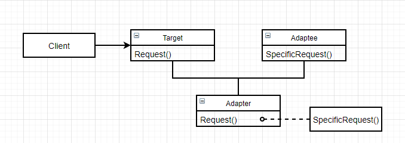
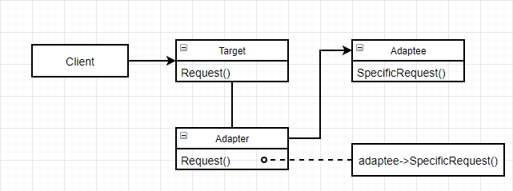

# 适配器（Adapter）

### 意图

将一个类的接口转换成客户希望的另外一个接口，使原本由于接口不兼容而不能一起工作的类可以一起工作

### 别名

包装器（wrapper）

### 适用性

- 想使用一个已经存在的类，而它的接口不符合要求
- 想创建一个可以复用的类，该类可以和其他不相关的类或不可预见的类（接口不一定兼容）协同工作
- （仅适用于对象Adapter）想使用一些已经存在的子类，但不可能对每一个都进行子类化以匹配它们的接口。对象适配器可以适配它的父类接口

### 结构

- 类适配器（继承）：

   

- 对象适配器（组合）：

   

### 参与者

- Client：与符合Target接口的对象协同
- Target：定义Client使用的与特定领域相关的接口
- Adaptee：定义一个已经存在的接口，这个接口需要适配
- Adapter：对Adaptee的接口与Target的接口进行适配

### 协作

Client在Adapter实例上调用一些操作，接着适配器调用Adaptee的操作实现这个请求

### 效果

类适配器：

- 用一个具体的Adapter类对Adaptee和Target进行匹配，但是当我们想要匹配一个类以及所有它的子类时，Adatper类无法胜任
- Adapter可以重定义Adaptee的一些行为
- 仅仅引入了一个对象，不需要通过额外的指针间接得到Adaptee

对象适配器：

- 允许一个Adapter与多个Adaptee（Adaptee本身与它的所有子类）同时工作，Adapter也可以一次给所有的Adaptee添加功能
- 从定义Adaptee的行为比较困难

其他因素：

- Adapter的匹配程度：各个Adapter对Adaptee与Target接口进行匹配的工作量不同
- 可插入的Adapter：当其他类使用一个类时，所需的假定条件越少，这个类就更具复用性。如果将接口匹配构建成一个类，就不需要假定对其他的类可见的是一个相同的接口，也就是说接口匹配可以使得我们将自己的类加入到一些现有的系统中
- 使用双向适配器提供透明操作

### 实例

我们有一个苹果手机，但是只有安卓数据线（type-c），不能用安卓数据线给苹果手机充电（lightning）：

```c++
class ApplePhone : public Phone {
public:
    virtual void UseLightning();
};
```

```c++
class AndroidPhone : public Phone {
public:
    virtual void UseTypeC();
};
```

```c++
class AndroidChargeLine {
public:
    virtual void Charge(Phone ap)
    	{ ap.UseTypeC(); }
};
```

```c++
ApplePhone iPhone;
AndroidPhone huawei;
AndroidChargeLine line;

line.Charge(huawei);	// 正确，安卓数据线可以给安卓手机充电
line.Charge(iPhone);	// 错误，安卓数据线不能给苹果手机充电
```

想用安卓数据线给苹果手机充电，必须有一个转接头：

- 对象适配器：

  ```c++
  class Adapter : public AndroidPhone {
  public:
      Adapter(ApplePhone *p) : ap(p) {}
      
      virtual void UseTypeC()	// 委托进行操作
      	{ ap->UseLightning(); }
  private:
      ApplePhone* ap;
  };
  ```

  ```c++
  ApplePhone iPhone;
  AndroidChargeLine line;
  Adapter AppleAndroidAdapter(iPhone);
  
  line.Charge(AppleAndroidAdapter);	// 正确，Adapter实现了UsingTypeC()方法
  ```

- 类适配器：

  ```c++
  class Adapter : public AndroidPhone, private ApplePhone {	// 公共方式继承接口，私有方式继承实现
  public:
      Adapter();
      
      virtual void UseTypeC()	// 自己实现操作
      	{ ApplePhone::UesLightning(); }
  };
  ```

  ```c++
  AndroidChargeLine line;
  Adapter AppleAndroidAdapter;
  
  line.Charge(AppleAndroidAdapter);	// 正确，Adapter实现了UsingTypeC方法
  ```

### 技巧

1. 使用C++实现适配器类：采用公共方式继承Target类，并且用私有方式继承Adaptee类
2. 可插入的适配器：有许多方法可以实现可插入的适配器，但首先，都要找到一个“窄”接口，即可用于适配的最小操作集，然后
   - 使用抽象操作：定义窄Adaptee接口相应的抽象操作，由子类（Adaptee）实现抽象操作
   - 使用代理对象：将请求转发到代理对象（Adaptee）
   - 参数化适配器：用一个或多个模块对适配器进行参数化，一个模块可以匹配一个请求，并且适配器可以为每个请求存储一个模块